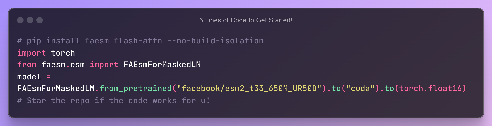
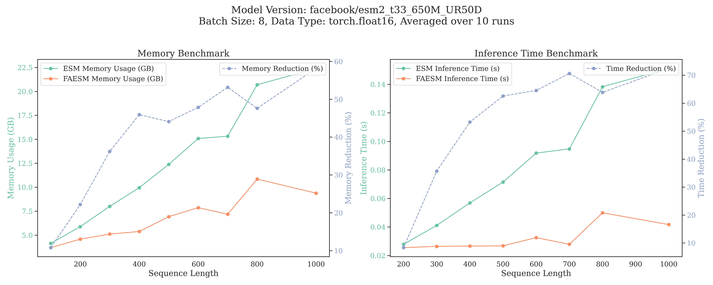

<div align="center">

# FAESM: A Drop-in Efficient Pytorch Implementation of ESM2

</div>

**F**lash **A**ttention **ESM** (FAESM) is an efficient PyTorch implementation of the [Evolutionary Scale Modeling (ESM)](https://github.com/facebookresearch/esm) family, which is a family of protein language models (pLMs) that can be used for various protein sequence analysis tasks. FAESM is designed to be more efficient than the official ESM implementation, which can save up to 60% of memory usage and 70% of inference time. The key features of FAESM are:

1. **Flash Attention**: FAESM uses the [FlashAttention](https://github.com/Dao-AILab/flash-attention) implementation, by far the most efficient implementation of the self-attention mechanism.
2. **Scalar Dot-Product Attention (SDPA)**: FAESM also provides an implementation of the [PyTorch Scalar Dot-Product Attention](https://pytorch.org/tutorials/intermediate/scaled_dot_product_attention_tutorial.html), which is a bit slower than the FlashAttention but it's compatible with most of the system and still faster than the official ESM implementation.
3. **Same Checkpoint**: FAESM is a drop-in replacement of ESM2, having the same API and checkpoint.

<div align="center">
  
</div>

# Table of Contents

- [FAESM: A Drop-in Efficient Pytorch Implementation of ESM2](#faesm-a-drop-in-efficient-pytorch-implementation-of-esm2)
- [Table of Contents](#table-of-contents)
- [Installation](#installation)
- [Usage](#usage)
    - [Training \[WIP\]](#training-wip)
- [Benchmarking](#benchmarking)
- [TODOs](#todos)
- [Appreciation](#appreciation)
- [Citation](#citation)

# Installation

1. Install PyTorch 1.12 and above if you haven't: `pip install pytorch`.

2. \[*Optional*\]: Install flash-attn if you want to use the flash attention implementation, which is the fastest and most efficient implementation. However, it can be a bit tricky to install so you can skip this step without any problem. In that case, skip this step and you will use Pytorch SDPA attention.

```bash
pip install flash-attn --no-build-isolation
```

Having trouble installing flash attention but still want to use it? A workaround is docker container. You can use the official nvidia pytorch [containers](https://catalog.ngc.nvidia.com/orgs/nvidia/containers/pytorch) which have all the dependencies for flash attention.

3. Install FAESM from github:

```bash
# if you want to use flash attention
pip install faesm[flash_attn]
```

```bash
# if you want to forego flash attention and just use SDPA
pip install faesm
```

# Usage

FAESM is a drop-in replacement for the official ESM implementation. You can use the same code as you would use the official ESM implementation. For example:

```python
import torch
from faesm.esm import FAEsmForMaskedLM

# Step 1: Load the tokenizer and FAESM model
device = 'cuda' if torch.cuda.is_available() else 'cpu'
model = FAEsmForMaskedLM.from_pretrained("facebook/esm2_t33_650M_UR50D").to(device).eval().to(torch.float16)
# Step 2: Prepare a sample input sequence
sequence = "MAIVMGRWKGAR"
inputs = model.tokenizer(sequence, return_tensors="pt")
inputs = {k: v.to(device) for k, v in inputs.items()}
# Step 3: Run inference with the FAESM model
outputs = model(**inputs)
# Step 4: Process and print the output logits and repr.
print("Logits shape:", outputs['logits'].shape)  # (batch_size, sequence_length, num_tokens)
print("Repr shape:", outputs['last_hidden_state'].shape)  # (batch_size, sequence_length, hidden_size)
# Step 5: start the repo if the code works for u!
```

For generative protein language like ProGen2:

### ProGen2

```python
import torch
from faesm.progen2 import ProGenForCausalLM
from transformers import AutoTokenizer
device = 'cuda' if torch.cuda.is_available() else 'cpu'
# Avilable model from HF: ["jinyuan22/ProGen2-small", "jinyuan22/ProGen2-base", "jinyuan22/ProGen2-xlarge"]
model = ProGenForCausalLM.from_pretrained("jinyuan22/ProGen2-small").to(torch.float16).to(device).eval() 
tokenizer = AutoTokenizer.from_pretrained("jinyuan22/ProGen2-small")

sequence = "2GFLPFRGADEGLAAREAATLAARGTAARAYREDSWAVPVPRGLLGDLTARVAALGAASPPPADPLAVTLDLHHVTAEVALTTVLDAATLVHGQTRVLSAEDAAEAATAAAAATEAYLERLQDFVLFMSASVRVWRRGNAAGATGPEWDQWYTVADRDALGSAPTHLAVLGRQADALCHFVLDRVAWGTCGTPLWSGDEDLGNVVATFAGYADRLATAPRDLIM1"

inputs = tokenizer(sequence, return_tensors="pt").to(device)
target = inputs.input_ids[0,...]
with torch.no_grad():
  logits = model(inputs.input_ids, labels=inputs.input_ids).logits[0,...]

logits = logits[:-1, ...]
target = target[1:]

bos_token, eos_token = 3, 4
if target[-1] in [bos_token, eos_token]:
    logits = logits[:-1, ...]
    target = target[:-1]

# remove unused logits
first_token, last_token = 5, 29
logits = logits[:, first_token:(last_token+1)]
target = target - first_token

ce_eval = torch.nn.functional.cross_entropy(input=logits.view(-1, logits.size(-1)), target=target.view(-1), reduction="mean").item()
print(ce_eval)
assert abs(ce_eval - 2.4) < 0.1 # 2.4 is the reference ce for the official progen2-small
```

### Training \[WIP\]

Working on an example training script for MLM training on Uniref50. For now, you can use the same training logic as how you would train the official ESM since the FAESM has no difference in the model architecture.
It's recommended to use the flash attention for training. Because in the forward pass, it unpads the input sequences to remove all the padding tokens, which 1) speeds up the training & reduces the memory usage and 2) it doesn't require batching sequences of similar length to avoid padding. Also, SDPA is still a good alternative if you can't install flash attention.

# Benchmarking


### FAESM vs. Official ESM2
Below  is the comparison of peak memory usage and inference time of FAESM with the official ESM2. We show that FAESM can save memory usage by up to 60% and inference time by up to 70% (length 1000). The benchmarking is done on ESM-650M with batch size 8, and a single A100 with 80GB of memory.



Below [@ANaka](https://github.com/ANaka) compares the SDFA implementation vs. official ESM2 (see his [PR](https://github.com/pengzhangzhi/faesm/pull/3)), where we can still get ~30% reduction by just pure pytorch, not too bad :) 


You can reproduce the benchmarking by running the following command:

```bash
pytest tests/benchmark.py
```

To test errors between FAESM and the official ESM2 implementation, you can run:

```bash
pytest tests/test_compare_esm.py
```

# TODOs

- Training script
- Integrate FAESM into EMSFold

# Appreciation

- The Rotary code is from [esm-efficient](https://github.com/uci-cbcl/esm-efficient).
- The ESM modules and the SDPA attention module are inspired by [ESM](https://github.com/facebookresearch/esm) and [DPLM](https://github.com/bytedance/dplm).
- I want to highlight that [esm-efficient](https://github.com/uci-cbcl/esm-efficient) also supports Flash Attention and offers more features such as quantitation and lora. Please check it out!!

This project started as a mutual disappointment with [Alex Tong(@atong01)](https://github.com/atong01) about why there is no efficient implementation of ESM (wasted a lot compute in training pLMs :(. He later helped me debugged the precision errors in my implementation and organize this repo. In the process, I talked @MuhammedHasan regarding his ESM-efficent implementation (see the issues [1](https://github.com/uci-cbcl/esm-efficient/issues/3) and [2](https://github.com/uci-cbcl/esm-efficient/issues/5)), and also Tri Tao about flash attention (see the [issue](https://github.com/Dao-AILab/flash-attention/issues/1359)). Of course shoutout to the ESM teams for creating the ESM family. None of the pieces of code would be possible without their help.

## Star History

[](https://star-history.com/#pengzhangzhi/faesm&Date)

# Citation

Please cite this repo if you use it in your work.

```bibtex
@misc{faesm2024,
  author       = {Fred Zhangzhi Peng,Pranam Chatterjee, and contributors},
  title        = {FAESM: An efficient PyTorch implementation of Evolutionary Scale Modeling (ESM)},
  year         = {2024},
  howpublished = {\url{https://github.com/pengzhangzhi/faesm}},
  note         = {Efficient PyTorch implementation of ESM with FlashAttention and Scalar Dot-Product Attention (SDPA)},
  abstract     = {FAESM is a drop-in replacement for the official ESM implementation, designed to save up to 60% memory usage and 70% inference time, while maintaining compatibility with the ESM API.},
}
```
